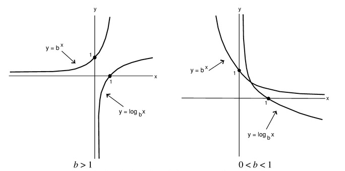
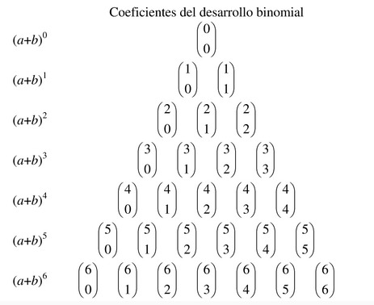

# Preliminares Matematicos 
@analisisAlgoritmos

@cristhiamdaniel

## Logaritmos

Por teoría de funciones se sabe que si $f$ es una función biyectiva entonces existe una función $f^{-1}$, denominada función inversa de $f$, de manera que $y = f(x)$ si y sólo si $x=f^{-1}(y)$. Por lo tanto, debido a que $y=b^x$ es una función biyectiva entonces cuenta con una función inversa. A tal función se le denomina **Función Logarítmica con Base *b***

Dado que la función exponencial con base *b* y la función logarítmica con base *b* son funciones inversas entre sí, entonces se tendrá la siguiente equivalencia:

$$y=\log_b x \iff x=b^y$$

En la siguiente figura se observan las funciones logarítmica y exponencial con base *b*, izquierda y derecha respectivamente.

### Propiedades de los Logaritmos

1. **Propiedad de la Base:** Si $x,y>0$ entonces: $$\log_b x = \log_b y \iff x=y$$
2. **Propiedad de la Multiplicación:** Si $x,y>0$ entonces: $$\log_b (xy) = \log_b x + \log_b y$$
3. **Propiedad de la División:** Si $x,y>0$ entonces: $$\log_b \frac{x}{y} = \log_b x - \log_b y$$
4. **Propiedad de la Potenciación:** Si $x>0$ entonces: $$\log_b x^n = n\log_b x$$

## Sucesiones

Definamos el concepto de **Función de Sucesión**: 

* Una **Función de Sucesión Finita** es una función cuyo dominio es el conjunto de los primeros *n* enteros positivos, esto es, $\{1, 2, 3, 4, ..., n\}$.

* Una **Función de Sucesión Infinita** es una función cuyo dominio es el conjunto de los números naturales, esto es, $\{1, 2, 3, 4, ...\}$.

Los números en la imagen de una función de sucesión se denominan **Elementos**. Los elementos de una función de sucesión, al ser listados en orden, forman una **Sucesión**. Si el dominio de la función de sucesión es finito entonces la sucesión es de hecho una **Sucesión Finita**. Si el dominio de la función de sucesión es infinito entonces se tiene una **Sucesión Infinita**.

## Series y Sumatorias

La **Notación Sigma** se define por la ecuación

$$\sum_{i=a}^{b} f(i) = f(a) + f(a+1) + f(a+2) + ... + f(b)$$

En donde $a$ y $b$ son enteros positivos y $a \leq b$. La notación $\sum_{i=a}^{b} f(i)$ se lee como "la suma de $f(i)$ para $i$ que va desde $a$ hasta $b$".

El término $f(a)$ se denomina **Limite Inferios de la Suma** y el término $f(b)$ se denomina **Limite Superior de la Suma**. 

## Principio de inducción

El **Principio de Inducción** es una técnica de demostración que se utiliza para demostrar la veracidad de una propiedad de un conjunto de números naturales. El principio de inducción se basa en dos pasos:

1. Demostrar que la propiedad es verdadera para el caso base, es decir, para el número $1$.
2. Demostrar que la propiedad es verdadera para el caso general, es decir, para cualquier número natural $n$.

Ejemplo:

Demostrar que para todo número natural $n$, se tiene que $1 + 2 + 3 + ... + n = \frac{n(n+1)}{2}$

Demostración:

1. Demostrar que la propiedad es verdadera para el caso base, es decir, para el número $1$.

$$1 = \frac{1(1+1)}{2}$$

2. Se supone que la fórmula es verdadera para $n=k$ y se debe demostrar que es verdadera para $n=k+1$.

$$\sum_{i=1}^{k+1} i = \frac{(k+1)((k+1)+1)}{2}$$

Partiremos del lado izquierdo de la ecuación:

$$\sum_{i=1}^{k+1} i = \sum_{i=1}^{k} i + (k+1)$$

$$\sum_{i=1}^{k+1} i = \frac{k(k+1)}{2} + (k+1)$$

$$\sum_{i=1}^{k+1} i = \frac{k(k+1)+2(k+1)}{2}$$

$$\sum_{i=1}^{k+1} i = \frac{(k+1)((k+1)+1)}{2}$$

Por lo tanto, se ha demostrado que la fórmula es verdadera para todo número natural $n$.

## Sucesiones y series

Una **Sucesión aritmética** es una sucesión cuyos términos se obtienen sumando una constante a cada término anterior. Por ejemplo, la sucesión $1, 3, 5, 7, 9, 11, 13, 15, 17, 19, ...$ es una sucesión aritmética cuya constante es $2$.

Una **Sucesión geométrica** es una sucesión cuyos términos se obtienen multiplicando una constante a cada término anterior. Por ejemplo, la sucesión $1, 2, 4, 8, 16, 32, 64, 128, 256, 512, ...$ es una sucesión geométrica cuya constante es $2$.

> Teorema: El N-ésimo término de una sucesión aritmética es: $$a_n = a_1 + (n-1)d$$

> Teorema: El N-ésimo término de una sucesión geométrica es: $$a_n = a_1 r^{n-1}$$

> Teorema: Si $a_1$ es el primer término de una sucesión aritmética y $d$ es la constante de la sucesión aritmética, entonces la suma de los primeros $n$ términos de la sucesión es: $$S_n = \frac{n(a_1 + a_n)}{2}$$

> Teorema: Si $a_1$ es el primer término de una sucesión geométrica y $r$ es la constante de la sucesión geométrica, entonces la suma de los primeros $n$ términos de la sucesión es: $$S_n = \frac{a_1(1-r^n)}{1-r}$$

## Teorema del binomio

Si $n \in \mathbb{N}$ la **Funcion Factorial** se define por la ecuación:

$$n! = n(n-1)(n-2)...(3)(2)(1)$$

o bien:

$$n! = n(n-1)!$$

Se define tambien que $0! = 1$.

Si $n \in \mathbb{N}$ y $k \in \mathbb{N}$ con $k \leq n$ entonces el **Coeficiente Binomial** $\binom{n}{k}$ se define por la ecuación:

$$\binom{n}{k} = \frac{n(n-1)(n-2)...(n-k+1)}{k(k-1)(k-2)...(1)}$$

Ademas se establece que:

$$\binom{n}{0} = \binom{n}{n} = 1$$

> Teorema: Si $n \in \mathbb{N}$ y $k \in \mathbb{N}$ con $k \leq n$ entonces: $$\binom{n}{k} = \frac{n!}{k!(n-k)!}$$

La expansion de la potencia de un binomio es un polinomio que se denomina **Expansion Binomial**. 

* $(a+b)^0 = 1$
* $(a+b)^1 = a+b$
* $(a+b)^2 = a^2 + 2ab + b^2$
* $(a+b)^3 = a^3 + 3a^2b + 3ab^2 + b^3$
* $(a+b)^4 = a^4 + 4a^3b + 6a^2b^2 + 4ab^3 + b^4$

Los coeficientes de los términos de la expansion binomial forman una estructura que se denomina **Triangulo de Pascal**. 

Coeficientes del desarrollo binomial:

O de manera equivalente:

> Teorema del binomio: $$(a+b)^n = \sum_{k=0}^{n} \binom{n}{k} a^{n-k} b^k$$

