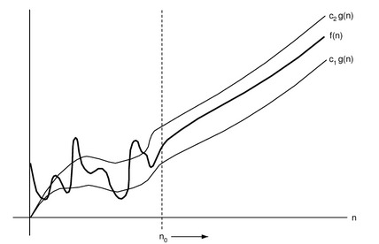
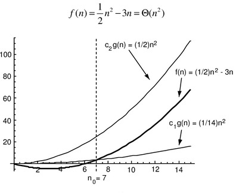
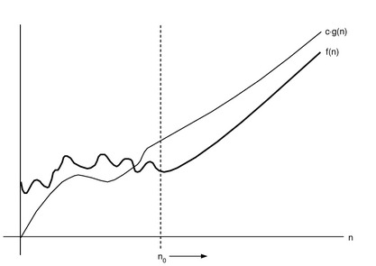
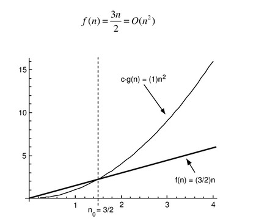
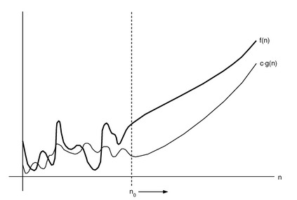

# Notación Asintótica

La Notación Asintótica describe el comportamiento de una función $f(n)$ respecto a otra función $g(n)$ cuando $n$ tiende al infinito. Originalmente solo se consideran funciones con dominio $\{0, 1, 2, 3, 4, 5, ...\}$, sin embargo, es posible extender el dominio de las funciones a los reales no negativos. Además, las funciones deberán ser **Asintóticamente No Negativas**, es decir, que $f(n) ≥ 0$ para todo $n$ suficientemente grande.

## Notación Big-Teta

Para una función asintóticamente no negativa $g(n)$ se define al conjunto de funciones $\Theta(g(n))$ como:
$$\Theta(g(n)) = \{f(n) : \exists c_1, c_2, n_0 > 0 \text{ tal que } 0 \leq c_1g(n) \leq f(n) \leq c_2g(n) \text{ para todo } n \geq n_0\}$$

Es decir, que una función $f(n)$, asintóticamente no negativa, pertenece al conjunto $\Theta (g(n))$ si existen constantes positivas $c_1$ y $c_2$ tales que permiten que $f(n)$ pueda ser intercalada entre $c_1g(n)$ y $c_2g(n)$ para valores de $n$ mayores o iguales a $n_0$. En otras palabras, los valores de $f(n)$, a partir de $n \geq n_0$, se ubican por encima o sobre $c_1g(n)$ y por debajo o sobre $c_2g(n)$. Si tal condición se da entonces para indicar que $f(n)$ es un miembro de $\Theta (g(n))$ se expresa como $f(n) \in \Theta (g(n))$ o bien como $f(n) = \Theta (g(n))$. Si $f(n) = \Theta (g(n))$ entonces se dice que $g(n)$ es un **Límite Asintóticamente Justo** para $f(n)$.

Ejemplo:

Sea $f(n)=\frac{1}{2} n^2 - 3n$, demostrar que $f(n) \in \Theta(n^2)$.

Se deben encontrar constantes positivas $c_1$ y $c_2$ tales que:

$$ 0 \leq c_1n^2 \leq \frac{1}{2} n^2 - 3n \leq c_2n^2 \text{ para todo } n \geq n_0 $$

La función  $f(n)=\frac{1}{2} n^2 - 3n$ es acotada superior e inferiormente por $g(n) = n^2$ a partir de $n_0 = 7$.

## Notación Big-O

Para una función asintóticamente no negativa $g(n)$ se define al conjunto de funciones $O(g(n))$ como:

$$O(g(n)) = \{f(n) : \exists c, n_0 > 0 \text{ tal que } 0 \leq f(n) \leq cg(n) \text{ para todo } n \geq n_0\}$$

Es decir, que una función $f(n)$, asintóticamente no negativa, pertenece al conjunto $O (g(n))$ si existe una constante positiva $c$ tal que permiten que $f(n)$ pueda ser intercalada por debajo de $cg(n)$ para valores de $n$ mayores o iguales a $n_0$. En otras palabras, los valores de $f(n)$, a partir de $n \geq n_0$, se ubican por debajo de $cg(n)$. Si tal condición se da entonces para indicar que $f(n)$ es un miembro de $O (g(n))$ se expresa como $f(n) \in O (g(n))$ o bien como $f(n) = O (g(n))$. Si $f(n) = O (g(n))$ entonces se dice que $g(n)$ es un **Límite Asintóticamente Superior** para $f(n)$.

Ejemplo:

Sea $f(n)=\dfrac{3n}{2}$, demostrar que $f(n) \in O(n^2)$.

Se deben encontrar constantes positivas $c$ y $n_0$ tales que:

$$ 0 \leq \dfrac{3n}{2} \leq c n^2 \text{ para todo } n \geq n_0 $$

## Notación Big-Omega

Para una función asintóticamente no negativa $g(n)$ se define al conjunto de funciones $\Omega(g(n))$ como:

$$\Omega(g(n)) = \{f(n) : \exists c, n_0 > 0 \text{ tal que } 0 \leq cg(n) \leq f(n) \text{ para todo } n \geq n_0\}$$

## Notacion o (o pequeño)

Para una función asintóticamente no negativa $g(n)$ se define al conjunto de funciones $o(g(n))$ como:

$$o(g(n)) = \{f(n) : \exists c, n_0 > 0 \text{ tal que } 0 \leq f(n) < cg(n) \text{ para todo } n \geq n_0\}$$

Es decir, los valores de $f(n)$, a partir de $n \geq n_0$ , se ubican estrictamente por debajo de $c \cdot g(n)$ para toda constante positiva $c$ (en la notación $O$ los valores de $f(n)$ se pueden ubicar por debajo o sobre $c \cdot g(n)$ para alguna constante positiva $c$).

## Notacion $\omega$ (omega pequeño)

Para una función asintóticamente no negativa $g(n)$ se define al conjunto de funciones $\omega(g(n))$ como:

$$\omega(g(n)) = \{f(n) : \exists c, n_0 > 0 \text{ tal que } 0 \leq cg(n) < f(n) \text{ para todo } n \geq n_0\}$$

Es decir, los valores de $f(n)$, a partir de $n \geq n_0$ , se ubican estrictamente por encima de $c \cdot g(n)$ para toda constante positiva $c$ (en la notación $\Omega$ los valores de $f(n)$ se pueden ubicar por encima o sobre $c \cdot g(n)$ para alguna constante positiva $c$).

