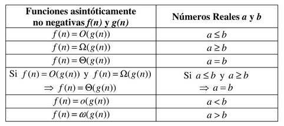
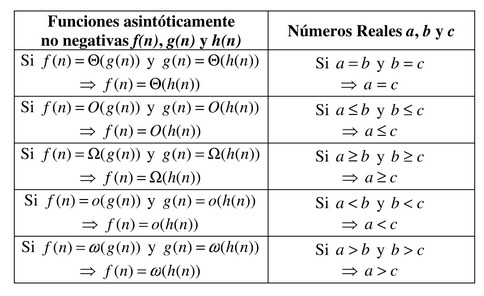
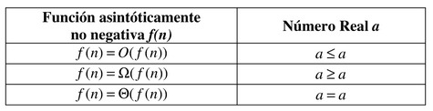
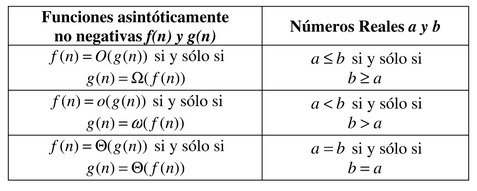

# Propiedades de la Notación Asintótica y Analogías con los Números Reales

Al examinar las definiciones de las notaciones $O$, $\Omega$, $\Theta$, $o$, $\omega$ es claro que éstas definen ordenamientos sobre el conjunto de todas las funciones asintóticamente no negativas. El orden de los elementos de un conjunto dado es un tema bien conocido y estudiado. Un claro ejemplo lo forman el conjunto de los números reales $\mathbb{R}$ cuando son ordenados bajo las relaciones $\leq$ (menor o igual), $\geq$ (mayor o igual), $=$ (igual), $<$ (estrictamente menor) y $>$ (estrictamente mayor). De hecho, estas relaciones de orden están presentes en las definiciones de la notación asintótica. Por ello, y como una forma para entenderlas mejor, es que en las siguientes tablas presentamos analogías entre las propiedades de la notación asintótica y las propiedades de los números reales.

## Orden

## Transitividad

## Reflexividad

## Equivalencias

**Ejercicio**

Demostrar que $2^{n+1}= \Theta(2^n)$. Indique los valores de $c_1$, $c_2$ y $n_0$.