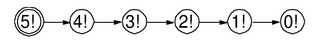
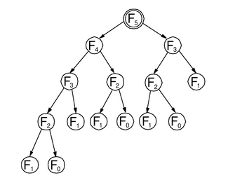

# Algoritmos Iterativos y Recursivos

Se dice que un algoritmo es **Iterativo** cuando una secuencia de uno o más pasos algorítmicos, y especificada una sola vez en la implementación, se ejecuta varias veces en sucesión dentro de un **Ciclo de Programa**. Un ciclo ejecuta el código que *lleva dentro* un número dado de veces, o hasta que una **Condición de Paro o Salida** se cumple. 

Por otro lado, la **Recursividad** es una forma de especificar un proceso por medio de la **Autoreferencia**. Es decir, instancias *complejas* del proceso son definidas en términos de instancias *simples* mientras que las instancias *más simples*, o **Casos Base**, son dados explícitamente.

Considérese nuevamente el algoritmo para el cálculo del factorial usando su definición recursiva.

```bash
Procedure factorial(integer n) // Llamada principal: la instancia "compleja". 
    if (n = 0) then // Caso Base: la instancia "más simple". 
        return 1 
    else // Autoreferencia: una instancia "simple". 
        return n * factorial(n - 1) 
    end-of-if 
end-of-procedure
```

El **Árbol de Llamadas Recursivas** es una estructura que permite visualizar la llamada principal y las autorreferencias (llamadas recursivas) que efectúa un algoritmo recursivo a fin de obtener su salida final. Por ejemplo, el árbol asociado al cálculo de $5!$ se presenta en la siguiente figura:



Nótese que en general para calcular $n!$ se harán $n-1$ llamadas recursivas. Por ejemplo, para encontrar $100!$ se efectuarán $99$ llamadas recursivas.


Ahora considérese el algoritmo para el cálculo de los números de Fibonacci usando su definición recursiva:

```bash
Procedure fibonacci(integer n) // Llamada principal: la instancia "compleja". 
    if (n = 0) then // Caso Base: la instancia "más simple". 
        return 0 
    else if (n = 1) then // Caso Base: la instancia "más simple". 
        return 1 
    else // Autoreferencia: una instancia "simple". 
        return fibonacci(n - 1) + fibonacci(n - 2) 
    end-of-if 
end-of-procedure
```

El árbol de llamadas recursivas asociado al cálculo de $F_5$ se presenta en la siguiente figura:



Para $F_5$, el árbol cuenta con 15 nodos: Seis nodos corresponden a llamadas recursivas, un nodo a la llamada principal y el resto a los casos base. Si el árbol fuese binario, balanceado y completo con n niveles, entonces su número total de nodos estaría dado por:

$$\sum_{i=0}^{n-1} 2^i = 2^n - 1$$

Al ignorar la llamada principal, se tendrá que, para encontrar $F_n (n \geq 2)$, se harán $2^n - 2$ llamadas recursivas. Por ejemplo, para encontrar $F_{100}$ se efectuarán $2^{100} - 2 = 1.267.650.600.228.229.401.496.703.205.376$ llamadas recursivas (1.267 billones de llamadas recursivas).